 

### ⋆｡˚ about me

> ♡ &nbsp;Charity Tiongson Ricabo, though you can call me **chacha, chet, chai,** or **rye** 
> ✧ &nbsp;bs computer engineering @ cebu institute of technology – university 
> ✧ &nbsp;software engineer intern @ innodata knowledge services 
> ✧ &nbsp;I specialize in translating user-centered designs into functional, full-stack applications. 
> ✧ &nbsp;Outside of development, I enjoy painting, reading, and photography.

 

### ⋆｡˚ things i build with

  
  
  
  
  
  
  

 

### ⋆｡˚ little projects

| | project | what it is |
|:-:|---|---|
| ✧ | [**GARBO**](https://github.com/helidastar/GARBO-CCRVibe) | waste-management app (next.js + supabase) |
| ✧ | [**MySpace Cafe**](https://github.com/helidastar/MySpace) | cafe menu kiosk + pantry tracker |
| ✧ | **Reflect.ly** | full-stack journaling app |
| ✧ | **PalengKart** | c# / .net market kiosk |

 

### ⋆｡˚ say hi

  

 

˚ ₊ ‧ ✧ &nbsp; thanks for stopping by &nbsp; ✧ ‧ ₊ ˚

