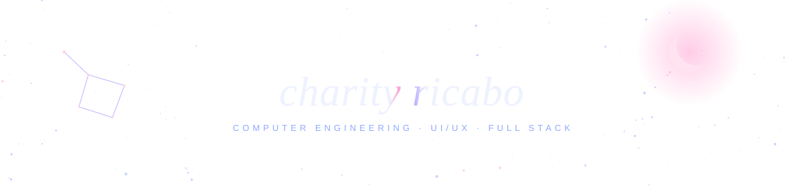

<picture>
  <source media="(prefers-color-scheme: light)" srcset="./assets/header-day.svg" />
  
</picture>

 

### ☾ &nbsp;about me

hi, i'm **charity tiongson ricabo**, but **chacha, chet, chai,** or **rye** works too.

- bs computer engineering @ cebu institute of technology – university
- software engineer intern @ innodata knowledge services
- i like taking user-centered designs and turning them into real, working full-stack apps
- off the clock: painting, reading, and taking photos

 

### ☾ &nbsp;things i build with

<picture>
  <source media="(prefers-color-scheme: light)" srcset="https://skillicons.dev/icons?i=ts,react,nextjs,tailwind,supabase,cs,dotnet,figma&theme=light" />
  
</picture>

 

### ☾ &nbsp;little projects

| | project | what it is |
|:-:|---|---|
| ✦ | [**SAGIP-AI**](https://github.com/helidastar/SAGIP-AI) | ai-assisted emergency reporting + incident prioritization (next.js + supabase) |
| ✦ | [**GARBO**](https://github.com/helidastar/GARBO) | campus waste-management app that rewards proper segregation |
| ✦ | **Reflect.ly** | full-stack journaling app |

 

### ☾ &nbsp;night sky activity

<picture>
  <source media="(prefers-color-scheme: light)" srcset="https://streak-stats.demolab.com?user=helidastar&background=00000000&hide_border=true&ring=7A5CFF&fire=D19A00&currStreakNum=2B1F66&sideNums=2B1F66&currStreakLabel=7A5CFF&sideLabels=7A5CFF&dates=7A70B5&stroke=CFC8EE" />
  
</picture>

  

<picture>
  <source media="(prefers-color-scheme: light)" srcset="https://raw.githubusercontent.com/helidastar/helidastar/output/star-chart-day.svg" />
  
</picture>

 

### ☾ &nbsp;say hi

  

 

<picture>
  <source media="(prefers-color-scheme: light)" srcset="./assets/footer-day.svg" />
  
</picture>

