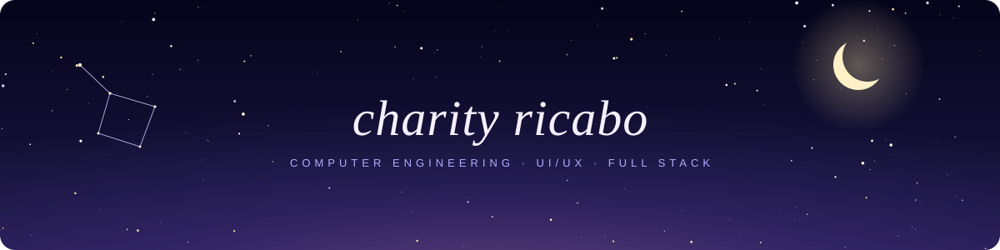

 

### ☾ &nbsp;about me

hi, i'm **charity tiongson ricabo**, but **chacha, chet, chai,** or **rye** works too.

- bs computer engineering @ cebu institute of technology – university
- software engineer intern @ innodata knowledge services
- i like taking user-centered designs and turning them into real, working full-stack apps
- off the clock: painting, reading, and taking photos

 

### ☾ &nbsp;things i build with

  

 

### ☾ &nbsp;little projects

| | project | what it is |
|:-:|---|---|
| ✦ | [**GARBO**](https://github.com/helidastar/GARBO-CCRVibe) | waste-management app (next.js + supabase) |
| ✦ | [**MySpace Cafe**](https://github.com/helidastar/MySpace) | cafe menu kiosk + pantry tracker |
| ✦ | **Reflect.ly** | full-stack journaling app |
| ✦ | **PalengKart** | c# / .net market kiosk |

 

### ☾ &nbsp;night sky activity

  

 

### ☾ &nbsp;say hi

  

 

